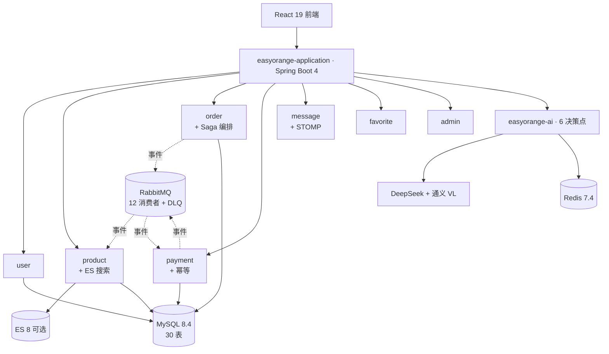
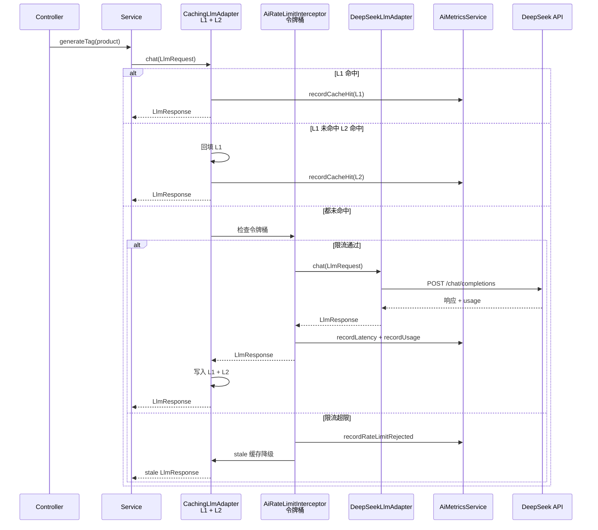
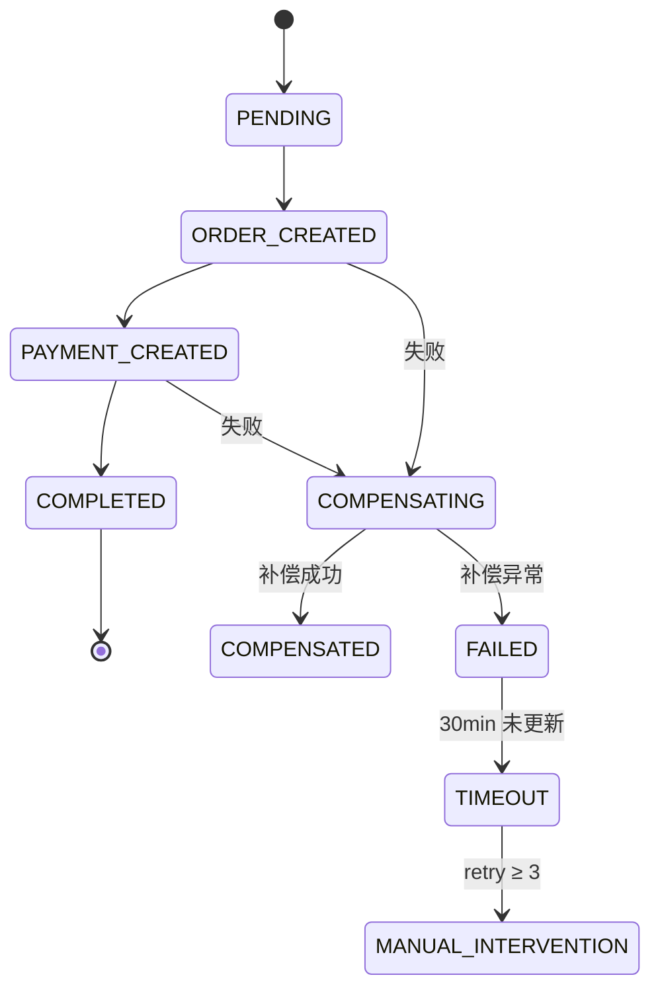

# EasyOrange — LLM × DDD：Java 架构工程化实战

> **EasyOrange** — 在 DDD 六边形里装 LLM：可换供应商、可降级、可观测的 AI 工程化落地。
>
> **11 模块全解耦 · 2,427 测试守卫 · 31 Port 接口 · 12 RabbitMQ 消费者 · 5 ADR · Domain 层行覆盖 84.1%**
>
> 业务聚焦核心流程（C2C 资产流转：固定价格 + 直发 + 平台不碰货），把复杂度留给架构与 AI 工程化。

[](LICENSE)
[](https://openjdk.java.net/)
[](https://spring.io/projects/spring-boot)
[](https://react.dev/)

## 四个并列钩子

| 钩子 | 数字锚点 | 一句话 |
|---|---|---|
| **AI 工程化** | 6 决策点 + 7 件套 | Port/Adapter + L1/L2 多级缓存 + Redisson 令牌桶 + stale 降级 + AiMetrics + Prompt YAML + TokenBudget + Bulkhead |
| **分布式可靠性** | Saga + Outbox + DLQ 三级重试 + 12 消费者 | 订单跨模块 Saga 编排 + 反向补偿；领域事件走 Spring Modulith Outbox → RabbitMQ；DLQ 指数退避 + terminal 转储 |
| **架构落地** | 11 模块 / 31 Port / DDD+CQRS+事件驱动 / ArchUnit 6 规则 | domain 层零框架依赖，编译期隔离，ADR 记录关键决策与拒绝项 |
| **质量门禁** | 2,427 测试（后端 1,389 + 前端 1,038）/ JaCoCo + PIT / Biome 0 errors | 后端 ArchUnit + JaCoCo 行≥80% + PIT 变异测试；前端 Vitest + Playwright + Biome |

## 项目定位

**EasyOrange — LLM × DDD 工程化实战**：在 DDD 六边形架构里集成 LLM，让 AI 链路可换供应商、可降级、可观测。

### 核心矛盾

DDD 铁律要求 domain 层零框架依赖，但 LLM 调用昂贵且不稳定，必须有多级缓存 + 限流降级 + 可观测。EasyOrange 用 Port/Adapter + 装饰器模式解了这个矛盾：

- `LlmPort` / `VisionPort` 接口定义在 domain 层 — 业务逻辑只依赖抽象
- `@Primary` 装饰器（`CachingLlmAdapter` / `CachingVisionAdapter`）在 adapter 层包装具体供应商（DeepSeek / 通义千问 VL）
- L1 Caffeine + L2 Redis 多级缓存让大部分重复估值请求不打 LLM
- `AiRateLimitInterceptor` 令牌桶按端点独立限流，超限返回 stale 缓存而不是 429
- `AiMetricsService` 把缓存命中率 / LLM p99 / 限流计数暴露到 Prometheus
- Prompt 版本化（YAML）+ Token 预算治理（`@TokenBudget` AOP）

6 个 AI 决策点（智能估值 / AI 文案 / AI 找货 / AI 评估 / AI 信用画像 / AI 审核）全部走这套工程化链路。

### 业务载体

C2C 资产流转（固定价格 + 直发 + 平台不碰货）—— 资产不只是旧手机，还包括没用完的会员、设计素材、健身卡时长、技能咨询时段。业务聚焦核心流程，把复杂度留给架构与 AI 工程化。

### 5 条 ADR 与拒绝项

Saga over 2PC/XA/TCC · CQRS 只在 4 个模块做 · AI 用 Port/Adapter + 装饰器 · AI 用 Bulkhead + TokenBudget AOP · 模块解耦与编译期隔离。每个决策都记录「为什么这样选 + 拒绝了什么」。

## 架构总览

### 11 模块依赖与 AI 工程化



### AI 调用流程



### Saga 编排 + 事件驱动 Outbox



**创建订单 Saga**：`CreateOrderSaga` 按 `productId` 排序加锁防死锁 → 创建订单 → 同步扣库存 → 创建支付；失败时逆序补偿 `restoreStock` → `cancelOrder`。

**事件投递可靠性**：业务表写入 + `EVENT_PUBLICATION` 表原子写入（Spring Modulith Outbox）→ 异步 externalize 到 RabbitMQ → 消费者继承 `AbstractDomainEventConsumer` 统一幂等/metrics/日志/异常 → DLQ → `DlqRetryScheduler` 每 5min 扫描重投或转储 terminal。

> 详细架构：[doc/架构/架构-系统架构.md](doc/架构/架构-系统架构.md) · 事件与 Saga：[doc/adr/0001-use-saga-over-2pc.md](doc/adr/0001-use-saga-over-2pc.md)

## 技术栈

| 层 | 技术 |
|---|------|
| **后端** | Java 25, Spring Boot 4.0.3, MyBatis-Plus 3.5.16, Spring Security OAuth2 Resource Server + JWT |
| **前端** | React 19, TypeScript 5, Vite 8, TanStack Query 5, Zustand 5, Tailwind CSS 4, shadcn/ui |
| **数据/消息** | MySQL 8.4, Redis 7.4, RabbitMQ 3.13, Elasticsearch 8 (可选) |
| **AI** | DeepSeek (文本), 通义千问 VL (视觉) |
| **DevOps** | Docker, docker-compose, Flyway 11.15.0, GitHub Actions |

## 快速开始

```bash
git clone https://gitee.com/cartethyia_XLS/easy-orange.git && cd easy-orange
docker compose -f compose.yaml up -d                    # MySQL/Redis/RabbitMQ
./mvnw install -DskipTests && ./mvnw spring-boot:run -pl easyorange-application  # :8080
cd easyorange-frontend && npm install && npm run dev    # :5173
```

> 项目支持**零配置启动**。详见 [AGENTS.md](./AGENTS.md)。

## 后端模块划分 (11 个 Maven 模块)

| 模块 | 职责 |
|------|------|
| `common` | Result/PageResult/注解/异常/Money/UUID v7 |
| `framework` | Security/Redis/缓存/Bloom/AOP/事件/文件/RabbitMQ |
| `user` | DDD：认证/注册/密码/个人资料/信用 |
| `product` | DDD + CQRS + 审核工作流 + 举报 + 全文搜索 |
| `order` | DDD + CQRS + Saga 补偿 |
| `payment` | DDD + CQRS |
| `message` | DDD + WebSocket + Repository |
| `favorite` | DDD 六边形 |
| `ai` | Port/Adapter + LLM/Vision/Embedding + 限流/缓存/可观测 |
| `admin` | 管理端 API |
| `application` | 启动入口 + Flyway + ArchUnit + ES 适配器 |

## AI 工程化

| 工程维度 | 实现方式 |
|---------|---------|
| **供应商隔离** | `LlmPort` / `VisionPort` / `EmbeddingPort` 接口抽象，DeepSeek/Qwen-VL 可互换 |
| **多级缓存** | `@Primary` 装饰器 `CachingLlmAdapter` 包裹 `DeepSeekLlmAdapter`，L1 Caffeine + L2 Redis + stale 降级 + Pub/Sub 失效 |
| **限流降级** | Redisson 令牌桶按端点限流，超限返回 stale 缓存，Redis 不可用时 fail-open |
| **预算治理** | `@TokenBudget` AOP — 6 个 AI 场景全部接入日预算控制 |
| **Prompt 版本化** | 6 个 YAML 模板，版本号管理，热加载 |
| **Bulkhead 隔离** | Resilience4j — `aiLlm`（并发 8）/ `aiVision`（并发 4）/ `dbHeavy`（并发 16） |
| **并行容错** | AI 搜索 4 路 `CompletableFuture` 并行，单步骤失败不影响整体 |

详见 [doc/集成/AI-资产管理.md](doc/集成/AI-资产管理.md)。

## 分布式可靠性与安全

| 维度 | 实现 |
|---|---|
| **Saga 分布式事务** | `CreateOrderSaga` 编排创建订单 → 同步扣库存 → 创建支付；失败逆序补偿；`SagaTimeoutScheduler` 检测超时/人工介入 |
| **Outbox 可靠事件** | Spring Modulith 原子写入 `EVENT_PUBLICATION` 表，崩溃后自动重发 |
| **DLQ 三级重试** | RetryTemplate 指数退避 → DLQ → `DlqRetryScheduler` 每 5 分钟扫描重投/转储 terminal |
| **消费者模板** | `AbstractDomainEventConsumer` 统一幂等、metrics、日志、异常；多消费者命名空间隔离 |
| **认证** | Spring Security OAuth2 Resource Server + JWT（Access + Refresh）+ Token 吊销黑名单 |
| **限流防重** | `RateLimitFilter` — GET 本地内存 / 写操作 Redisson 分布式令牌桶；写操作 3s 防连点；fail-open |
| **幂等** | `@Idempotent` + `Idempotency-Key` 头，24h 缓存成功响应 |
| **审计日志** | `AuditLogAspect` 发布 `AuditLogEvent` → Outbox → `AuditLogEventConsumer` 异步入库 |
| **依赖安全** | OWASP Dependency-Check 在 CI `security-scan` job 执行，CVSS ≥ 8 阻断 |

## 前端工程化

```
React 19 + TypeScript 5 + Vite 8 + Tailwind CSS 4 + shadcn/ui
TanStack Query 5（服务端状态）+ Zustand 5（客户端状态）
Vitest（单元）+ Playwright（E2E）+ Biome（lint/format，0 errors）
```

- **Admin 设计系统**：自研「暖橙指挥中心」管理端，覆盖 dashboard / users / products / orders / categories / reports / stats，全部真实后端 API 对接
- **组件化**：Portal / Dialog / Drawer / Sheet 等 120+ 处使用；共享 UI 组件 95 个；管理端组件 107 个
- **无障碍**：a11y 属性 296 处，Biome 0 errors / 0 warnings
- **状态管理**：171 处 TanStack Query hooks；Zustand 分 store 管理 auth/chat/ui
- **测试**：111 文件 / 1,038 用例

## 质量门禁与 CI

```
后端：JUnit 5 + Mockito → JaCoCo（行≥80%/分支≥60%）→ PIT 变异测试 → ArchUnit 架构守卫
前端：Vitest + Playwright → Biome lint/format 0 errors
CI：GitHub Actions 双 job（build-and-test + security-scan）
```

- **ArchUnit 6 规则**：domain 零框架依赖 / CQRS 读写分离 / 模块间仅通过 port/valueobject 通信 / port 必须有 adapter 实现 / 禁止 infrastructure 包
- **JaCoCo**：Domain 层行覆盖 **84.1%**，分支覆盖 **71.5%**
- **PIT**：order 模块 mutation 70% / test strength 89%；product 模块 mutation 70% / test strength 79%
- **Git hooks**：`commit-msg` 校验 Conventional Commits，`pre-commit` 本地检查

数字单一来源见 [doc/工程指标.md](doc/工程指标.md)。

## Docker 部署

```bash
docker compose -f compose.yaml up -d                    # MySQL/Redis/RabbitMQ
docker compose up -d elasticsearch                      # 可选 ES
cd easyorange-frontend && docker build -t easyorange-frontend . && docker run -p 80:80 easyorange-frontend
```

## 项目结构

```
easy-orange/
├── easyorange-backend/     # Spring Boot (11 Maven 模块)
├── easyorange-frontend/    # React SPA
├── doc/架构/               # 架构规范文档
├── doc/集成/               # 业务专题 + API 速查
├── doc/adr/                # 架构决策记录
├── PRODUCT_DIRECTION.md    # 业务场景说明
├── CLAUDE.md               # AI 项目指南
├── AGENTS.md               # Agent 使用说明
└── CHANGELOG.md            # 更新日志
```

## 开发规范与贡献

- Conventional Commits · `main` / `develop` / `feature/*` / `bugfix/*` · Google Java Style + Biome
- PR 前本地验证：`./mvnw test` + `npm test`，详见 [CONTRIBUTING.md](./CONTRIBUTING.md)

## 许可证

MIT License — 详见 [LICENSE](LICENSE) 文件

---

<div align="center">

**EasyOrange** · LLM × DDD：Java 架构工程化实战 · Java 25 + Spring Boot 4 · DDD + CQRS + Saga + 事件驱动 + AI 工程化 · [Gitee](https://gitee.com/cartethyia_XLS/easy-orange) · [更新日志](./CHANGELOG.md)

</div>
