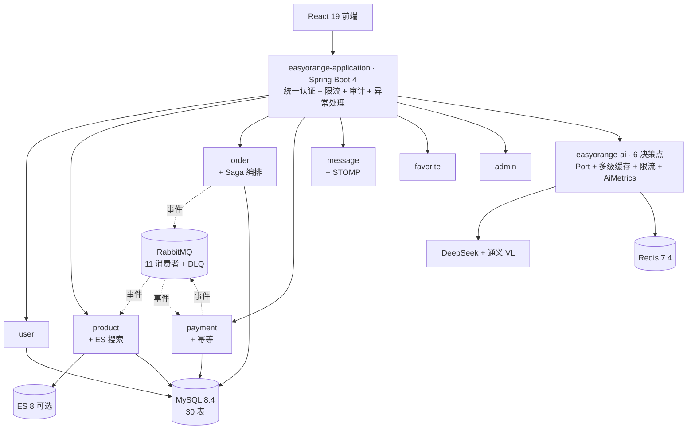
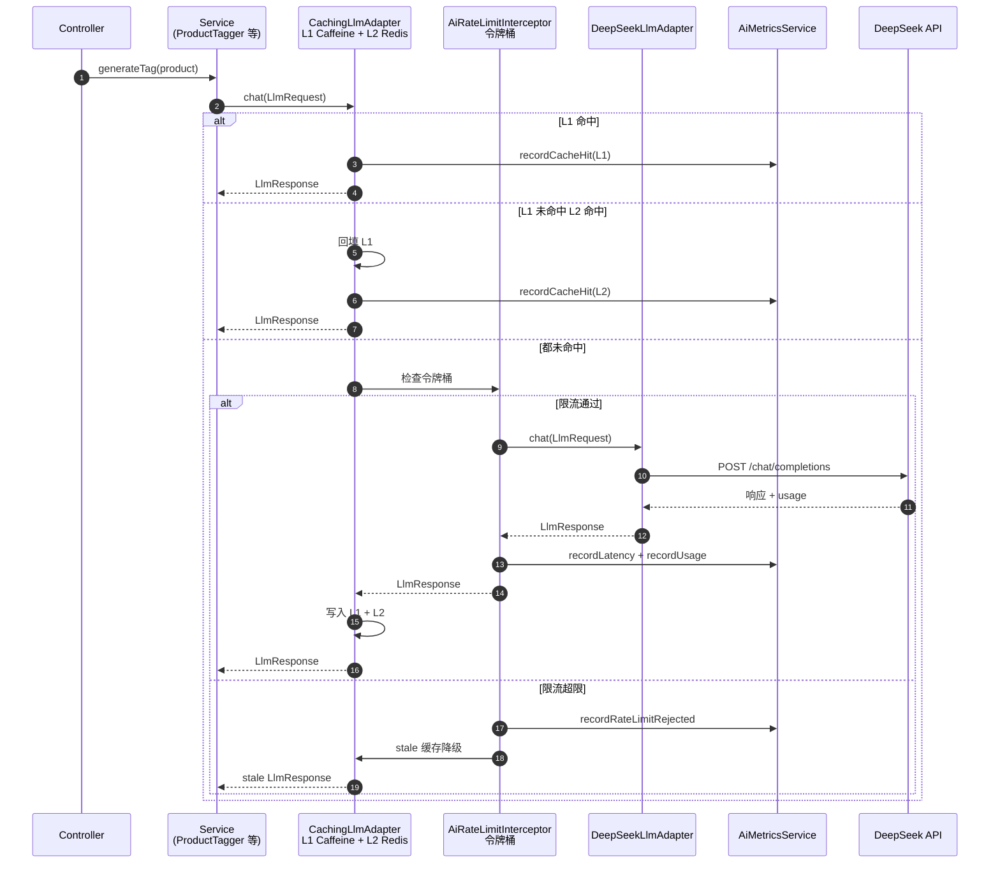
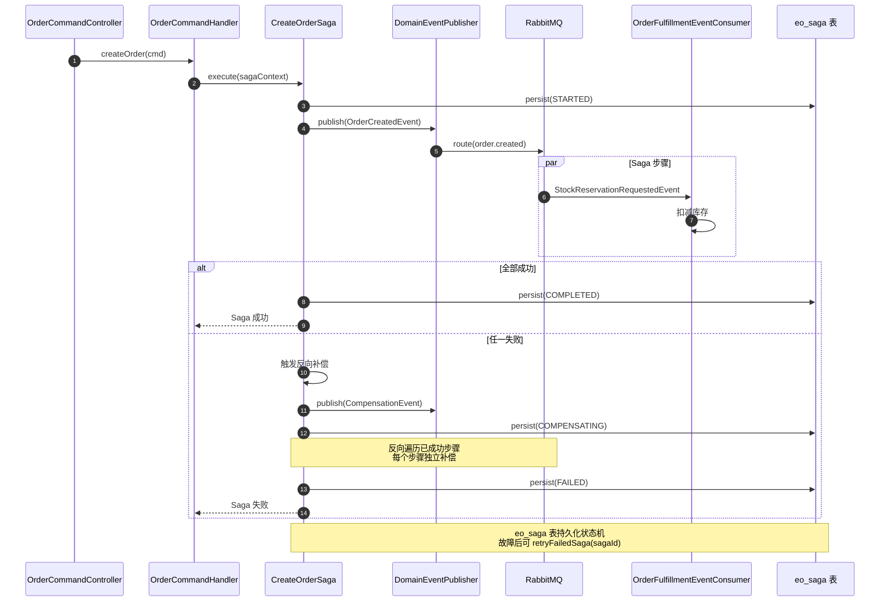

# EasyOrange — LLM × DDD：Java 架构工程化实战

> **EasyOrange** — 在 DDD 六边形里装 LLM：可换供应商、可降级、可观测的 AI 工程化落地。
>
> **11 模块全解耦 · 2,170 测试守卫 · 7 对 Port/Adapter 防腐层 · 6 AI 决策点全带 Port/Adapter + L1/L2 多级缓存 + 令牌桶限流 + stale 降级 + AiMetrics 可观测 + Prompt 版本化（YAML）+ Token 预算治理（@TokenBudget AOP）· 4 ADR 架构决策记录。**
>
> 业务聚焦核心流程（C2C 资产流转：固定价格 + 直发 + 平台不碰货），把复杂度留给架构与 AI 工程化。 · 2025 年 11 月启动开发

[](LICENSE)
[](https://openjdk.java.net/)
[](https://spring.io/projects/spring-boot)
[](https://react.dev/)

## 项目定位

**EasyOrange — LLM × DDD 工程化实战**：在 DDD 六边形架构里集成 LLM，让 AI 链路可换供应商、可降级、可观测。

### 核心矛盾

DDD 铁律要求 domain 层零框架依赖（不能引 Spring / 不能引 LLM SDK），但 LLM 调用昂贵且不稳定，必须有多级缓存 + 限流降级 + 可观测。EasyOrange 用 Port/Adapter + 装饰器模式解了这个矛盾：

- `LlmPort` / `VisionPort` 接口定义在 domain 层 — 业务逻辑只依赖抽象
- `@Primary` 装饰器（`CachingLlmAdapter` / `CachingVisionAdapter`）在 adapter 层包装具体供应商（DeepSeek / 通义千问 VL）
- L1 Caffeine + L2 Redis 多级缓存让大部分重复估值请求不打 LLM
- `AiRateLimitInterceptor` 令牌桶按端点独立限流，超限返回 stale 缓存而不是 429
- `AiMetricsService` 把缓存命中率 / LLM p99 / 限流计数暴露到 Prometheus
- Prompt 版本化（YAML）+ Token 预算治理（@TokenBudget AOP）

6 个 AI 决策点（智能估值 / AI 文案 / AI 找货 / AI 评估 / AI 信用画像 / AI 审核）全部走这套工程化链路。

### 业务载体

C2C 资产流转（固定价格 + 直发 + 平台不碰货）—— 业务聚焦核心流程，把复杂度留给架构与 AI 工程化。

### 三个并列钩子

| 钩子 | 数字锚点 | 一句话 |
|---|---|---|
| **架构落地** | 11 模块 / 7 对 Port-Adapter / 11 消费者+DLQ / 30 表 / 2,170 测试 | DDD/CQRS/Saga/事件驱动 在真实业务压力下的协同落地 |
| **架构决策记录** | 4 ADR + 13 关键决策可独立讲解 | 每个架构选择都有"为什么这样选 + 拒绝了什么"的 ADR 记录 |
| **AI 工程化** | 6 决策点 + 7 件套 | Port/Adapter + L1/L2 多级缓存 + 令牌桶限流 + stale 降级 + AiMetrics 可观测 + Prompt 版本化 + Token 预算治理 |

> **4 个核心架构模式**：`DDD 六边形` · `CQRS` · `Saga` · `事件驱动` — 11 模块全解耦、4 模式 4 ADR。落地细节见 [doc/架构/架构-DDD规范.md](doc/架构/架构-DDD规范.md) + [doc/adr/](doc/adr/)。

> **By the numbers**：11 模块 / 28 Port 接口 / 11 RabbitMQ 消费者 + DLQ / 6 AI 决策点 / 30 表 / 2,170 测试 / 4 ADR。数字单一来源见 [doc/工程指标.md](doc/工程指标.md)。

## 架构总览（一图看懂）

### 11 模块依赖与 AI 工程化



### AI 调用流程 · Port/Adapter + 多级缓存 + 限流 + 可观测



### Saga 补偿流程 · 跨模块分布式事务



> 详细架构文档：[doc/架构/架构-系统架构.md](doc/架构/架构-系统架构.md) — 含 11 模块依赖图 + 部署架构 + 可观测性栈
> 技术债务清单：[doc/技术债务清单.md](doc/技术债务清单.md) — 13 条已知债务，主动承认工程判断

## 技术栈

| 层 | 技术 |
|---|------|
| **后端** | Java 25, Spring Boot 4.0.3, MyBatis-Plus 3.5.16, Spring Security + JWT |
| **前端** | React 19, TypeScript 5, Vite 8, TanStack Query 5, Zustand 5, Tailwind CSS 4, shadcn/ui |
| **数据库** | MySQL 8.4, Redis 7.4, Elasticsearch 8 (可选) |
| **消息队列** | RabbitMQ 3.13 (Spring AMQP 4.0.x) |
| **AI** | DeepSeek (文本), 通义千问 VL (视觉) |
| **认证** | JWT (Access + Refresh Token) |
| **迁移** | Flyway 11.15.0 |
| **部署** | Docker, docker-compose, compose.yaml (@ServiceConnection) |

## 快速开始

### 环境要求

- JDK 25+, Node.js 18+, Maven 3.8+
- Docker 20.10+ (可选)
- MySQL 8.0+ / Redis 7.0+ (本地或 Docker)

### 三步启动

```bash
# 1. 克隆
git clone https://gitee.com/cartethyia_XLS/easy-orange.git && cd easy-orange

# 2. 启动基础设施 (MySQL 8.4 + Redis 7.4 + RabbitMQ 3.13)
docker compose -f compose.yaml up -d

# 3. 安装依赖并启动
./mvnw install -DskipTests          # 后端
cd easyorange-frontend && npm install && npm run dev  # 前端 :5173
cd .. && ./mvnw spring-boot:run -pl easyorange-application  # 后端 :8080
```

> 项目支持**零配置启动**,MySQL/Redis 使用默认端口即可运行。详见 [AGENTS.md](./AGENTS.md)。

## 后端模块划分 (11 个 Maven 模块)

| 模块 | 职责 |
|------|------|
| `easyorange-common` | 通用组件 (Result, PageResult, 注解, 异常, Money 值对象) |
| `easyorange-framework` | 框架基础设施 (Security, Redis, 多级缓存, Bloom 过滤器, AOP, 事件, 文件, 分布式 ID, 一致性哈希, **RabbitMQ 消息队列**) |
| `easyorange-user` | 用户模块 (DDD: 认证/注册/密码管理/个人资料/信用) |
| `easyorange-product` | 商品模块 (DDD + CQRS + 审核工作流 + 举报 + 全文搜索) |
| `easyorange-order` | 订单模块 (DDD + CQRS + Saga 补偿) |
| `easyorange-payment` | 支付模块 (DDD + CQRS) |
| `easyorange-message` | 消息模块 (DDD + WebSocket + Repository 模式) |
| `easyorange-favorite` | 收藏模块 (DDD 六边形架构) |
| `easyorange-ai` | AI 模块 (Port/Adapter + LLM + Embedding + Vision + 限流 + 缓存) |
| `easyorange-admin` | 管理端模块 (用户/商品/订单/分类/举报管理 API) |
| `easyorange-application` | 应用启动入口 + Flyway + 架构测试 + ES 搜索适配器 |

## AI 工程化

AI 模块采用 Port/Adapter 六边形架构，核心关注点在工程化深度而非 AI 能力本身：

| 工程维度 | 实现方式 |
|---------|---------|
| **供应商隔离** | LlmPort/VisionPort 接口抽象，DeepSeek/Qwen-VL 可互换，新增供应商只需新增 adapter |
| **多级缓存** | `@Primary` 装饰器模式（CachingLlmAdapter 包裹 DeepSeekLlmAdapter），L1 Caffeine + L2 Redis + stale 降级 |
| **限流降级** | Redis 令牌桶按端点独立限流（5-30 次/分），超限时优先返回 stale 缓存，Redis 不可用时 fail-open |
| **并行容错** | 搜索增强 4 路 CompletableFuture 并行，单步骤超时/失败不影响其他步骤，5s 总超时 |

详见 [doc/集成/AI-资产管理.md](doc/集成/AI-资产管理.md)。

## Docker 部署

```bash
docker compose -f compose.yaml up -d       # 启动全部服务 (MySQL/Redis/RabbitMQ)
docker compose up -d elasticsearch        # 可选: ES 搜索 (需先构建镜像)
```

前端容器化:

```bash
cd easyorange-frontend && docker build -t easyorange-frontend . && docker run -p 80:80 easyorange-frontend
```

## 项目结构

```
easy-orange/
├── easyorange-backend/     # Spring Boot (11 Maven 模块, DDD 六边形架构)
├── easyorange-frontend/    # React SPA (Vite + TypeScript)
├── doc/架构/               # 架构规范文档
├── doc/集成/               # 业务专题 + API 速查
├── PRODUCT_DIRECTION.md    # 业务场景说明 (非商业模式)
├── CLAUDE.md               # AI 项目指南
├── AGENTS.md               # Agent 使用说明 (含完整 API 清单)
└── CHANGELOG.md            # 更新日志
```

## 开发规范

- Conventional Commits (`feat/fix/docs/refactor/chore`)
- 分支策略: `main` / `develop` / `feature/*` / `bugfix/*`
- 代码风格: Google Java Style + Biome (前端, 替代 ESLint + Prettier)
- 测试: 后端 JUnit 5 (1,218 用例) + 前端 Vitest/Playwright (952 用例)，JaCoCo 覆盖率 + PIT 变异测试双重质量门禁
- 架构守卫: ArchUnit (`ArchitectureRulesTest`)

## 贡献指南

1. Fork → 2. 创建分支 → 3. 提交 → 4. Push → 5. Pull Request

## 许可证

MIT License — 详见 [LICENSE](LICENSE) 文件

---

<div align="center">

**EasyOrange** · LLM × DDD：Java 架构工程化实战 · Java 25 + Spring Boot 4 · DDD + CQRS + Saga + 事件驱动 + AI 工程化 · 业务聚焦核心流程，把复杂度留给架构与 AI 工程化 · [Gitee](https://gitee.com/cartethyia_XLS/easy-orange) · [更新日志](./CHANGELOG.md)

</div>
