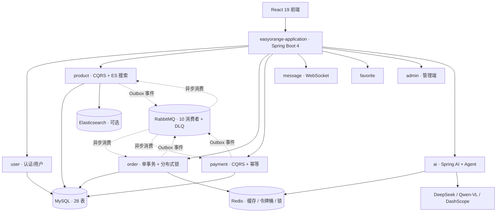
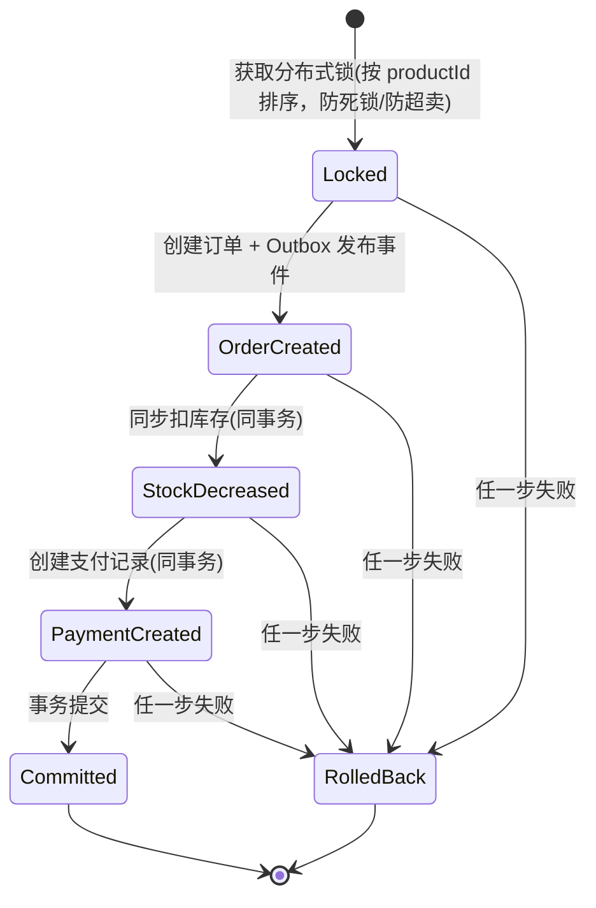

# EasyOrange — LLM × DDD：Java 架构工程化实战

> **EasyOrange** — 在 DDD 六边形架构里集成 LLM：AI 链路**可换供应商、可降级、可观测**的工程化实战项目。
>
> **11 模块解耦 · 33 Port 编译期隔离 · 10 事件消费者 · 8 条 ADR · 2,400+ 测试守卫 · AI 6 决策点 × 8 项工程化**
>
> 业务载体：C2C 资产流转（固定价格 + 直发 + 平台不碰货），把复杂度留给架构与 AI 工程化。

[](LICENSE)
[](https://openjdk.java.net/)
[](https://spring.io/projects/spring-boot)
[](https://react.dev/)

## 两条技术主线

EasyOrange 在两条技术主线上都有独立且完整的落地，可分别展开讲解：

| AI 应用工程化 | 架构落地 |
|---|---|
| **Spring AI 2.0 框架化** — 6 决策点直接注入 `ChatModel` / `EmbeddingModel` bean，切换供应商只改配置不改业务代码（[ADR-0008](doc/adr/0008-ai-migrate-to-spring-ai-framework.md)） | **DDD 六边形 + CQRS** — 33 Port 编译期隔离，domain 层零框架依赖；CQRS 仅 product / order / payment / message 4 模块（[ADR-0002](doc/adr/0002-cqrs-scope-only-4-modules.md)） |
| **轻量级 Agent 编排** — `AiSearchEnhancer` 4 路并行 Tool Calling，单步骤 5s 超时降级，无 LangChain4j 黑盒 | **拒绝 Saga** — 订单创建本地单事务 + Redisson 分布式锁防超卖 + Outbox 事件副作用（[ADR-0007](doc/adr/0007-order-saga-single-tx-observability.md)） |
| **限流 / 预算 / 降级** — Redisson 分布式令牌桶 + stale 降级 + `@TokenBudget` 日预算 AOP | **事件驱动可靠投递** — Spring Modulith Outbox → RabbitMQ → DLQ 三级重试 + traceId 全链路 |
| **Prompt 工程化** — 6 个 YAML 模板版本化渲染 | **架构治理** — ArchUnit 11 条规则守卫分层 + 8 条 ADR 记录决策 |
| **Embedding 真实现 + 多模态** — text-embedding-v3 kNN + BM25 混合检索 + Qwen-VL 拍照识别自动上架 | **质量门禁** — 2,400+ 测试（JaCoCo 行覆盖 + PIT 变异测试双重验证），前端 Biome 0 errors |

## 架构总览



- **前端**：React 19 SPA，C 端 + 管理端（暖橙指挥中心设计系统）双布局
- **后端**：Spring Boot 4 聚合 11 个 Maven 模块，DDD 六边形 + CQRS 分层
- **数据**：MySQL（Flyway 迁移）+ Redis（缓存 / 令牌桶 / 分布式锁 / 会话）+ Elasticsearch（可选，BM25 + kNN）
- **消息**：Spring Modulith Outbox → RabbitMQ Topic Exchange，10 个事件消费者，DLQ 三级重试
- **AI**：DeepSeek（Chat）/ Qwen-VL（Vision）/ DashScope（Embedding），统一 OpenAI 兼容协议

> 更完整的组件级架构见 [doc/架构/架构-系统架构.md](doc/架构/架构-系统架构.md)。

### 事件驱动：Outbox → RabbitMQ → DLQ

`DomainEventPublisher` → Spring Modulith 在数据库 `EVENT_PUBLICATION` 表中与应用事务**同原子**持久化事件 → 事务提交后异步 externalize 到 RabbitMQ Topic Exchange（`eo.domain.events`，路由键由事件类名自动派生，`ProductCreatedEvent` → `product.created`）→ 每个消费者独占队列，`EventIdempotencyChecker` 保证精确一次 → 失败进 DLQ，`DlqRetryScheduler` 每 5 分钟重投（<3 次），毒消息转储 `eo.dlq.terminal`。审计日志同样走 Outbox（`AuditLogAspect` → `AuditLogEventConsumer` 异步入库）。

**traceId 全链路**：Brave `TracingFilter` 提取 HTTP traceId → MDC → `MdcTaskDecorator` 透传 @Async → MQ message header → 消费者 MDC，日志与 Micrometer 指标统一关联。

### 订单创建（拒绝 Saga）

下单在单一本地 `@Transactional` 内完成，无补偿路径：



任一步失败 → 事务整体回滚，抛 `OrderCreationException`，**无补偿路径**。取消 / 退款 / 完成等跨模块副作用由 `OrderLifecycleEventConsumer` 消费订单生命周期事件异步触发（恢复库存 / 标记售出）。详见 [ADR-0007](doc/adr/0007-order-saga-single-tx-observability.md)。

## AI 应用工程化

### 核心矛盾与解法

DDD 铁律要求 domain 层零框架依赖，但 LLM 调用昂贵且不稳定，必须有限流 / 降级 / 预算治理。解法：**AI 基础设施全面框架化为 Spring AI 2.0**（[ADR-0008](doc/adr/0008-ai-migrate-to-spring-ai-framework.md)，Supersedes ADR-0003）——六个业务服务直接注入 Spring AI `ChatModel` / `EmbeddingModel` bean（DeepSeek `chatModel` + Qwen-VL `visionChatModel` + DashScope `embeddingModel`，统一走 OpenAI 兼容协议），删除自研 `LlmPort` / `VisionPort` / `CachingLlmAdapter` / `AiMetricsService`；业务级治理保留：令牌桶限流、`@TokenBudget` 日预算、Prompt YAML 版本化。

### 6 个 AI 决策点

| 侧 | 决策点 |
|---|---|
| **资产方** | 智能估值 / AI 营销文案 / AI 信用画像 |
| **认领方** | AI 智能找货 / AI 物品评估 / AI 信用画像 |

### 轻量级 Agent 编排

[`AiSearchEnhancerAdapter`](./easyorange-backend/easyorange-ai/src/main/java/com/cartethyia/easyorange/ai/adapter/outbound/AiSearchEnhancerAdapter.java) 是基于 Spring AI `ChatModel` 手写的轻量 Agent Planner（4 路 Tool 编排，无 LangChain4j 黑盒）：

```
用户自然语言查询
  ├─ Tool 1: LLM 意图识别（找货/比价/问答）→ 路由
  ├─ Tool 2: 商品标签生成（品类/成色/价格区间）
  ├─ Tool 3: 市场分析（基于历史成交统计）
  └─ Tool 4: 建议问题生成（自动追问模糊需求）
```

- 4 路 `CompletableFuture` 并行（虚拟线程），单步骤 5s 超时降级不影响整体
- 每路 Tool 复用同一套 Spring AI 模型 + 限流 / 预算链路

### AI 工程化 8 项

1. **Spring AI 2.0 框架化** — ChatModel / EmbeddingModel bean，供应商 options 可换
2. **Embedding 真实现** — text-embedding-v3，dims=1024 与 ES `dense_vector` 对齐
3. **Redisson 分布式令牌桶限流** — Redis 不可用时 fail-open
4. **stale 降级** — 限流超限返回陈旧缓存
5. **`@TokenBudget` 日预算** — AOP 统一治理
6. **Prompt YAML 版本化** — 6 个模板
7. **多模态 Vision** — Qwen-VL 拍照识别自动上架
8. **4 路并行 Tool Calling** — 单步骤超时降级

> 完整机制（估值 / 营销文案 / WebSocket 实时沟通协议）见 [doc/集成/AI-资产管理.md](doc/集成/AI-资产管理.md)。

## 架构治理

> 设计理念：不是列「我用了什么」，而是讲「我评估过什么、为什么不用」。

| 层 | 机制 | 解决的问题 |
|---|---|---|
| **决策层** | 8 条 ADR（[doc/adr/](doc/adr/)） | 记录「为什么 + 拒绝项」，不让选型沦为偏好 |
| **守卫层** | ArchUnit 11 条规则（[`ArchitectureRulesTest`](./easyorange-backend/easyorange-application/src/test/java/com/cartethyia/easyorange/architecture/ArchitectureRulesTest.java)） | CI 阻断违规：domain 零框架 / CQRS 读写分离 / 模块间端口隔离 / 端口必有适配器 / 禁止 infrastructure 包 |
| **验证层** | JaCoCo + PIT 变异测试 | JaCoCo 看「代码跑过」，PIT 注入变异看「测试能否发现缺陷」 |

### 拒绝项清单

| 被拒绝方案 | 原因 | 替代方案 | ADR |
|---|---|---|---|
| 2PC / XA / Seata AT | 强一致锁表久 + 连接池代理侵入 | 本地单事务 + Redisson 分布式锁 + Outbox | [ADR-0007](doc/adr/0007-order-saga-single-tx-observability.md) |
| Saga 编排（跨模块补偿） | 单库下补偿与回滚重复、失败状态随事务回滚丢失 | 本地单事务 + 分布式锁 + Outbox | [ADR-0007](doc/adr/0007-order-saga-single-tx-observability.md) |
| 全模块 CQRS | user / favorite / ai 等读写比均衡或调用外部 API，收益 < 维护成本 | 仅 product / order / payment / message 4 模块 | [ADR-0002](doc/adr/0002-cqrs-scope-only-4-modules.md) |
| LangChain4j | Tool 调用反射黑盒 + 升级兼容差 | 手写 AiSearchEnhancer 4 路 Tool 编排 | [ADR-0008](doc/adr/0008-ai-migrate-to-spring-ai-framework.md) |
| Milvus / PGVector | SKU < 10 万，向量库 ROI 低 | ES BM25 召回 + LLM semantic rerank（RAG 轻量版） | 隐含决策 |
| Kafka / Pulsar 默认 MQ | Kafka 无原生 DLQ；1 事件 → 10 消费者模型不匹配；Pulsar 本地太重 | RabbitMQ Topic Exchange + 队列级 DLQ | [ADR-0005](doc/adr/0005-messaging-bus-select-rabbitmq-over-kafka-nats-pulsar.md) |

## 模块结构

| 模块 | DDD 角色 | 核心定位 |
|---|---|---|
| **application** | 启动聚合层 | 主入口、Flyway、跨模块适配器、ArchUnit 守卫 |
| **common** | 通用基础 | 统一响应体 / 异常 / 领域事件接口 / 工具 |
| **framework** | 框架适配层 | Security（双 Token）/ Redis / MyBatis / RabbitMQ / 限流 / 审计 AOP |
| **user** | 业务限界上下文 | 认证（双 Token）、用户资料、信用分 |
| **product** | 业务限界上下文 | 商品（CQRS）+ 审核 / 举报 + ES 搜索 + 语义检索 |
| **order** | 业务限界上下文 | 订单（CQRS）+ 单事务 + 分布式锁 + 生命周期事件 |
| **payment** | 业务限界上下文 | 支付（CQRS）+ 幂等 + Mock 网关 |
| **message** | 业务限界上下文 | 消息（CQRS）+ 站内信 + WebSocket / STOMP 实时沟通 |
| **favorite** | 业务限界上下文 | 收藏 + 批量校验 |
| **ai** | 业务限界上下文 | Spring AI 框架化 + Agent 编排 + 令牌桶 / 预算 / Prompt |
| **admin** | 管理端边界 | 后台 API（用户 / 商品审核 / 订单 / 举报 / 统计） |

## 技术栈

| 层 | 技术 |
|---|---|
| **后端** | Java 25 · Spring Boot 4 · MyBatis-Plus 3.5 · MapStruct |
| **安全** | Spring Security OAuth2 Resource Server · **双 Token**：RSA 签名 Access（30min 无状态）+ Opaque Refresh（Redis SHA-256，HttpOnly Cookie，轮换 + 复用检测）· BCrypt |
| **前端** | React 19 · TypeScript · Vite · TanStack Query 5 · Zustand 5 · Tailwind 4 · shadcn/ui · Biome |
| **数据 / 消息** | MySQL 8.4（Flyway）· Redis 7.4 · RabbitMQ 3.13 · Elasticsearch 8（可选） |
| **AI** | Spring AI 2.0 · DeepSeek · Qwen-VL · DashScope Embedding |
| **可靠性** | Resilience4j · Redisson（分布式锁 / 令牌桶）· Spring Modulith Outbox |
| **可观测** | Micrometer + Prometheus · Brave（traceId）· Spring AI Observation · 结构化日志 |
| **DevOps** | Docker / docker-compose · GitHub Actions · Flyway 11 |

## 快速开始

```bash
git clone https://github.com/471292781/EasyOrange.git && cd easy-orange
docker compose -f compose.yaml up -d                               # MySQL / Redis / RabbitMQ
cd easyorange-backend && ./mvnw install -DskipTests && ./mvnw spring-boot:run -pl easyorange-application   # :8080
cd easyorange-frontend && npm install && npm run dev               # :5173
```

> 零配置启动：敏感配置复制 `.env.example` → `.env`。完整命令（PIT 变异测试、JaCoCo、OWASP、E2E）见 [AGENTS.md](./AGENTS.md)「常用命令」。

## 文档地图

| 资源 | 内容 |
|---|---|
| [AGENTS.md](./AGENTS.md) | 唯一规范来源：技术栈、数据库表、状态机、错误码、模块依赖、开发规范 |
| [PRODUCT_DIRECTION.md](./PRODUCT_DIRECTION.md) | 业务场景（C2C 资产流转：固定价格 + 直发 + 平台不碰货） |
| [DATABASE.md](./DATABASE.md) | 数据库表结构与设计 |
| [doc/工程指标.md](doc/工程指标.md) | 测试数 / 覆盖率单一事实来源（2,400+ 为取整下限） |
| [doc/架构/](doc/架构/) | 架构规范（系统架构 / DDD / 安全认证 / 数据库迁移 / 部署） |
| [doc/集成/](doc/集成/) | 业务专题（AI 资产管理 / API 速查） |
| [doc/adr/](doc/adr/) | 8 条架构决策记录 |

## 项目结构

```
easy-orange/
├── easyorange-backend/     # Spring Boot 后端（11 Maven 模块，DDD 六边形）
├── easyorange-frontend/    # React 前端（C 端 + 管理端）
├── doc/                    # 架构 / 集成 / ADR / 面试
├── compose.yaml            # MySQL + Redis + RabbitMQ（+ 可选 ES）
└── .claude/rules/ecc/      # AI 编码规则（ECC）
```

## 贡献与许可

- **贡献**：Conventional Commits · `main / develop / feature/* / bugfix/*`，见 [CONTRIBUTING.md](./CONTRIBUTING.md)
- **安全**：漏洞报告见 [SECURITY.md](./SECURITY.md)
- **许可**：MIT License

---

<div align="center">

**EasyOrange** · LLM × DDD：Java 架构工程化实战 · Java 25 + Spring Boot 4 · DDD + CQRS + 本地单事务/分布式锁 + 事件驱动 + AI 工程化 · [GitHub](https://github.com/471292781/EasyOrange)

</div>
